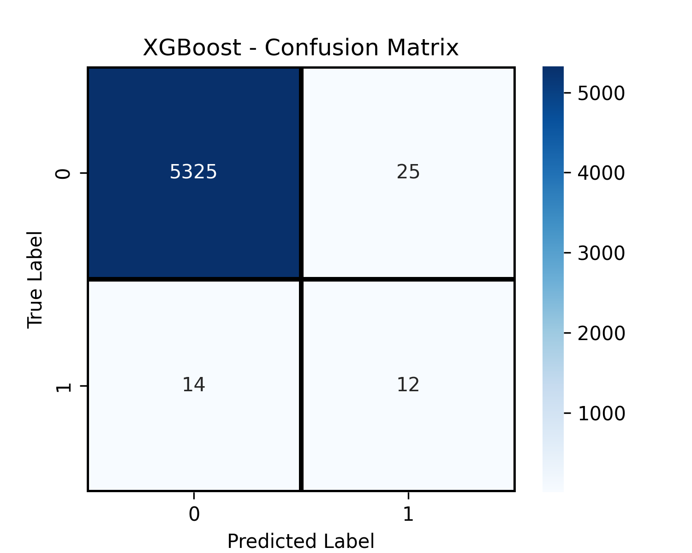

# Fraud Detection using Machine Learning

## Description
This project detects fraudulent transactions using **Logistic Regression, Random Forest, and XGBoost**. It handles imbalanced data, evaluates models with **F1 Score** and **ROC-AUC**, and visualizes results with **confusion matrices** and **ROC curves** for easy performance comparison.

## Dataset
- The dataset contains transactional data with features such as transaction amount, time, and user details.
- It is highly **imbalanced**, reflecting real-world scenarios where fraud is rare.
- For privacy, the dataset is not included but can be obtained from [source/link] or replaced with your own.

## Features
- Transaction amount
- Transaction time
- Customer ID / anonymized features
- Additional engineered features for model performance

## Models Used
1. **Logistic Regression** – baseline model with interpretable coefficients.
2. **Random Forest** – ensemble model for capturing complex patterns.
3. **XGBoost** – gradient boosting optimized for speed and accuracy, handling imbalanced data effectively.

## Evaluation
- **Metrics:** F1 Score, ROC-AUC
- **Visualizations:** Confusion Matrices, ROC Curves

## Results
- Achieved high F1= 0.7284 and ROC-AUC= 0.3810  scores, minimizing false positives and negatives.
- XGBoost performed best in identifying fraudulent transactions.

## Screenshots

### ROC Curve

### Confusion Matrix

## Video Demo

